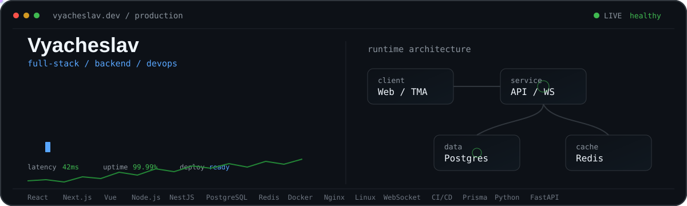

<p align="center">
  
</p>

<br>

## About me

Full-Stack Developer focused on **backend architecture, scalable web platforms, real-time systems and production infrastructure**.

I work across the full product lifecycle - from architecture and frontend to backend, databases, deployment and production support.

<table>
<tr>
<td width="50%" valign="top">

### Main focus

- Backend Architecture
- Web Platforms
- Real-Time Systems
- Telegram Mini Apps
- AdTech & Analytics
- DevOps & Infrastructure

</td>

<td width="50%" valign="top">

### How I work

- Production-first mindset
- Clean architecture
- Reliable backend logic
- Automation where it makes sense
- Debug root causes, not symptoms
- Build → Deploy → Improve

</td>
</tr>
</table>

> Reliable software beats impressive demos.

I build full-stack products from the first architecture decision to production deployment.

My main focus is **backend architecture, scalable web applications, real-time systems and infrastructure**.  
I also work across frontend, databases, integrations and deployment when the product requires it.

<br>

---

## `> tech_stack`

<div align="center">


</div>

<br>

<table>
<tr>
<td width="50%" valign="top">

### Frontend

**React** · **Next.js** · **Vue**

TypeScript · JavaScript

Redux · Pinia

Modern responsive interfaces

</td>

<td width="50%" valign="top">

### Backend

**Node.js** · **NestJS** · **Express**

Python · FastAPI

REST APIs · WebSocket

Business logic & integrations

</td>
</tr>

<tr>
<td width="50%" valign="top">

### Data

**PostgreSQL** · **Redis**

Prisma ORM

Caching

Analytics & reporting

Database architecture

</td>

<td width="50%" valign="top">

### Infrastructure

**Docker** · **Nginx** · **Linux**

CI/CD

Production deployments

Service configuration

Monitoring & debugging

</td>
</tr>
</table>

<br>

---

## `> what_i_build`

<table>
<tr>
<td width="50%" valign="top">

### 🌐 Web Platforms

Full-stack applications with authentication, dashboards, APIs, databases and production infrastructure.

</td>

<td width="50%" valign="top">

### ⚙️ Backend Systems

APIs, complex business logic, database architecture, caching and external integrations.

</td>
</tr>

<tr>
<td width="50%" valign="top">

### ⚡ Real-Time Systems

WebSocket services, live events, notifications and realtime application features.

</td>

<td width="50%" valign="top">

### ✈️ Telegram

Telegram Mini Apps, bots, authorization, integrations and platform-specific backend services.

</td>
</tr>

<tr>
<td width="50%" valign="top">

### 📊 AdTech

Advertising platforms, targeting, impressions, clicks, publisher systems, analytics and reporting.

</td>

<td width="50%" valign="top">

### 🐳 Infrastructure

Dockerized environments, Nginx, Linux servers, deployment and production troubleshooting.

</td>
</tr>
</table>

<br>

---

## `> engineering_approach`

<table>
<tr>
<td width="25%" align="center">

### 01

**Architecture**

Understand the problem before writing the solution.

</td>

<td width="25%" align="center">

### 02

**Build**

Frontend, backend, data and integrations as one product.

</td>

<td width="25%" align="center">

### 03

**Deploy**

Docker, infrastructure, configuration and production launch.

</td>

<td width="25%" align="center">

### 04

**Improve**

Monitor behaviour, fix bottlenecks and scale what matters.

</td>
</tr>
</table>

<br>

<div align="center">

`ARCHITECTURE`　→　`BUILD`　→　`DEPLOY`　→　`OBSERVE`　→　`IMPROVE`

</div>

<br>

---

## `> areas_of_interest`

```yaml
backend:
  - scalable architecture
  - APIs
  - realtime communication
  - performance

products:
  - SaaS platforms
  - Telegram ecosystem
  - advertising technology
  - analytics

infrastructure:
  - Docker
  - Nginx
  - Linux
  - production reliability
```

<br>

---

## `> developer_mode`

```diff
+ Production-first mindset
+ Clean backend architecture
+ Full product ownership
+ Automation over repetitive work
+ Debug the cause, not the symptom
+ Ship, observe, improve
```

<br>

---

## `> github`

<div align="center">

### My work lives here.

<a href="https://github.com/Viacheslav999">
  
</a>

<br><br>

`Full-Stack Development · Backend Architecture · DevOps`

<br><br>

<sub>
Building software that works outside localhost.
</sub>

</div>
